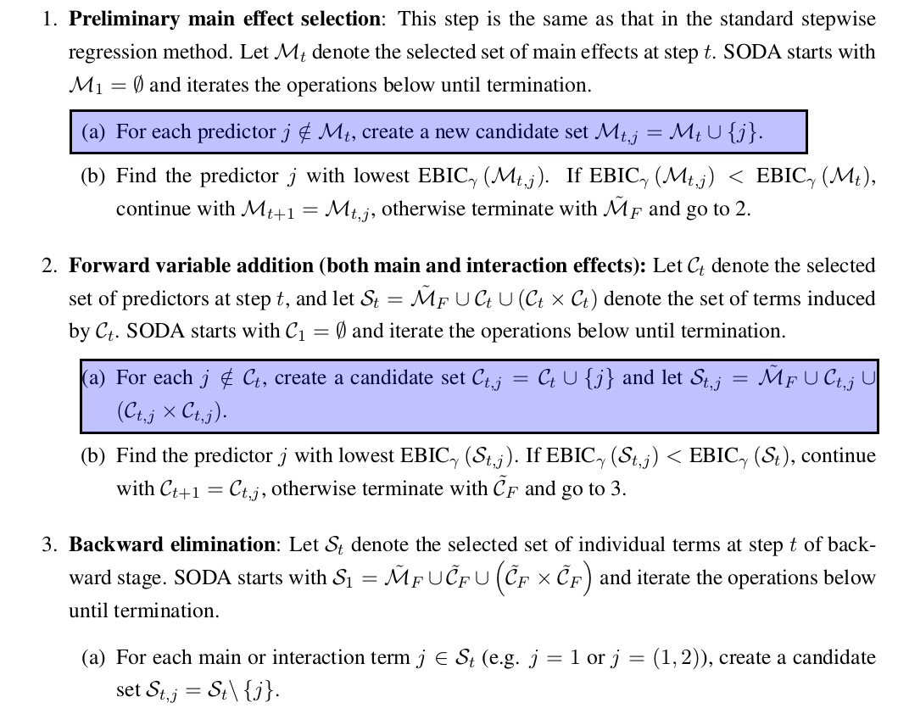
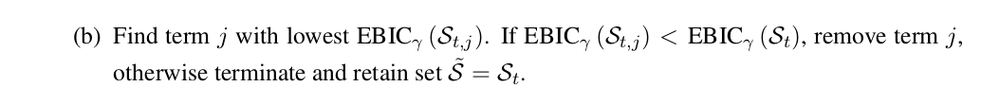
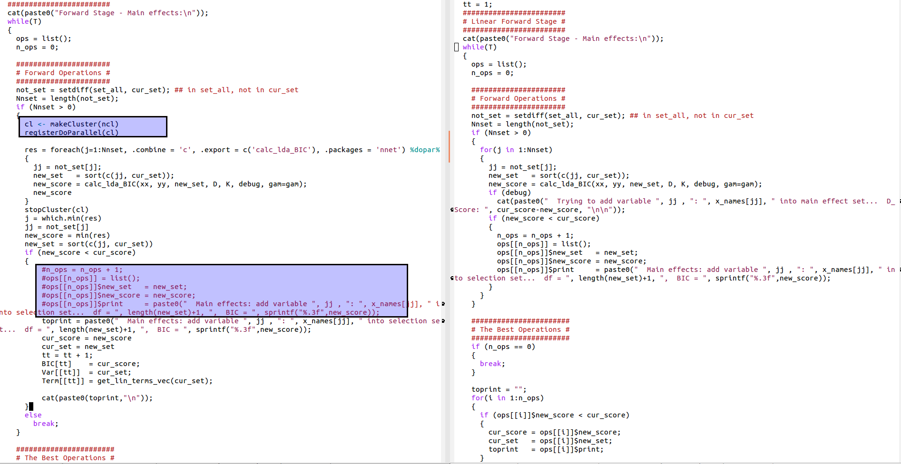

# soda_parallel

The R pacakge aims to implement soda in parallel, and the original R package refers to [soda](https://CRAN.R-project.org/package=sodavis).

The main soda algorithms are as follows:

This package implement the above highlight part of soda in parallel.

The main differences are as follows:

And I test the program on my PC, it is obvious that the parallel-version has a significant improvement.
